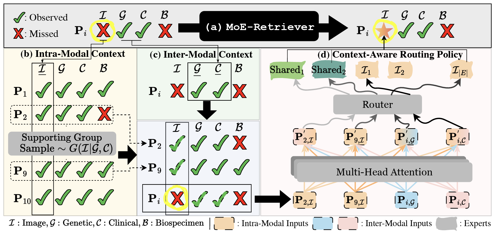

 # Generate, Then Retrieve: Addressing Missing Modalities in Multimodal Learning via Generative AI and MoE

[](https://opensource.org/licenses/MIT) [](https://sites.google.com/view/genai4health-aaai-2025)

Official implementation for "Generate, Then Retrieve: Addressing Missing Modalities in Multimodal Learning via Generative AI and MoE" accepted by AAAI 2025 GenAI4Health (Oral).  

- Authors: [Sukwon Yun*](https://sukwonyun.github.io/), [Jiayi Xin*](https://www.linkedin.com/in/jiayi-xin/), [Inyoung Choi](https://www.linkedin.com/in/inyoung-choi-77105221b/), [Jie Peng](https://openreview.net/profile?id=~Jie_Peng4), [Ying Ding](https://yingding.ischool.utexas.edu/) , [Qi Long](https://www.med.upenn.edu/long-lab/currentgroupmembers.html) and [Tianlong Chen](https://tianlong-chen.github.io/) (*:Equal Contribution)

## Overview

In multimodal machine learning, effectively addressing the missing modality scenario is crucial for improving performance in downstream tasks such as in medical contexts where data may be incomplete. Although some attempts have been made to effectively retrieve embeddings for missing modalities, two main bottlenecks remain: the (1) consideration of both intra- and inter-modal context, and the (2) cost of embedding selection, where embeddings often lack modality-specific knowledge. In response, we propose MoE-Retriever, a novel framework inspired by the design principles of Sparse Mixture of Experts (SMoE). First, MoE-Retriever define a supporting group for intra-modal inputs, i.e., samples that commonly lack the target modality. This group is formed by selecting samples with complementary modality combinations for the target modality. It is then integrated with intermodal inputs—i.e., inputs from different modalities of a sample—thereby establishing both intra- and inter-modal contexts. These inputs are processed by Multi-Head Attention, generating context-aware embeddings that serve as inputs to the SMoERouter, which automatically selects the most relevant experts, i.e., the embedding candidates to be retrieved. Comprehensive experiments on both medical and general multimodal datasets demonstrate the robustness and generalizability of MoE-Retriever, marking a significant step forward in embedding retrieval methods for incomplete multimodal data.



## **Environmental Setup (Step-by-step guide to install FastMoE library)**

```
conda create -n flex-moe python=3.10 -y
conda activate flex-moe
conda install pytorch==2.0.1 torchvision==0.15.2 torchaudio==2.0.2 pytorch-cuda=11.7 -c pytorch -c nvidia -y
conda install nvidia::cudatoolkit conda-forge::cudatoolkit-dev -y
conda install -c conda-forge gxx=10.4 -y
export LD_LIBRARY_PATH=/path_to_anaconda3/flex-moe/lib:$LD_LIBRARY_PATH
export CUDA_HOME=/path_to_anaconda3/envs/flex-moe
git clone https://github.com/laekov/fastmoe.git 
cd fastmoe 
USE_NCCL=0 python setup.py install
cd ..
conda install dm-tree scikit-learn tqdm pandas -y
conda install -c conda-forge scanpy nibabel -y
```

## **Dataset (ADNI)***
***Please refer to Flex-MoE's repository here: [Flex-MoE](https://github.com/UNITES-Lab/Flex-MoE)**

1. To access ADNI dataset, please first visit ADNI website: https://adni.loni.usc.edu/ and apply for the data access here: https://ida.loni.usc.edu/collaboration/access/appApply.jsp?project=ADNI.
2. Once you get an access, login to IDA and dowlonad necessary files for each modality.
    - Image:
        - {Subject ID}_{Scan date}
    - Genomic:
        - ADNI 1 SNP genotype data - PLINK
        - ADNI GO/2 SNP genotype data - Complete PLINK for sets 1 - 9
        - ADNI GO/2 SNP genotype data - Complete PLINK for sets 10 - 15
        - ADNI3 SNP genotype data Set 1 - PLINK
        - ADNI3 SNP genotype data Set 2 - PLINK
    - Clinical:
        - MEDHIST
        - NEUROEXM
        - PTDEMOG
        - RECCMEDS
        - VITALS
    - Biospecimen:
        - APOERES
        - UPENNBIOMK_ROCHE_ELECSYS

3. Once the files are ready, please run preprocessing codes in each modality.


## **Usage and Examples**
**Run Example**
```
python main.py \
    --data adni \
    --modality IG \
    --num_candidates 8 \
    --num_candidates_shared 4 \
    --lr 1e-4 \
    --num_experts 32 \
    --num_layers_fus 1 \
    --top_k 4 \
    --train_epochs 20 \
    --warm_up_epochs 5 \
    --hidden_dim 128 \
    --batch_size 16 \
    --device 0
```
